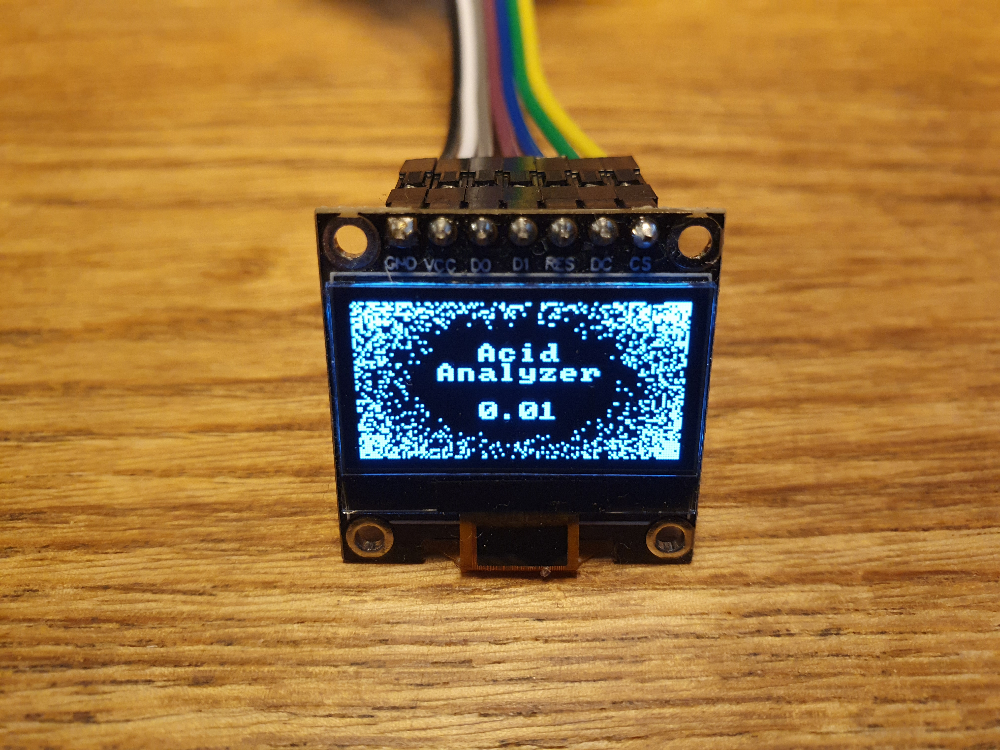
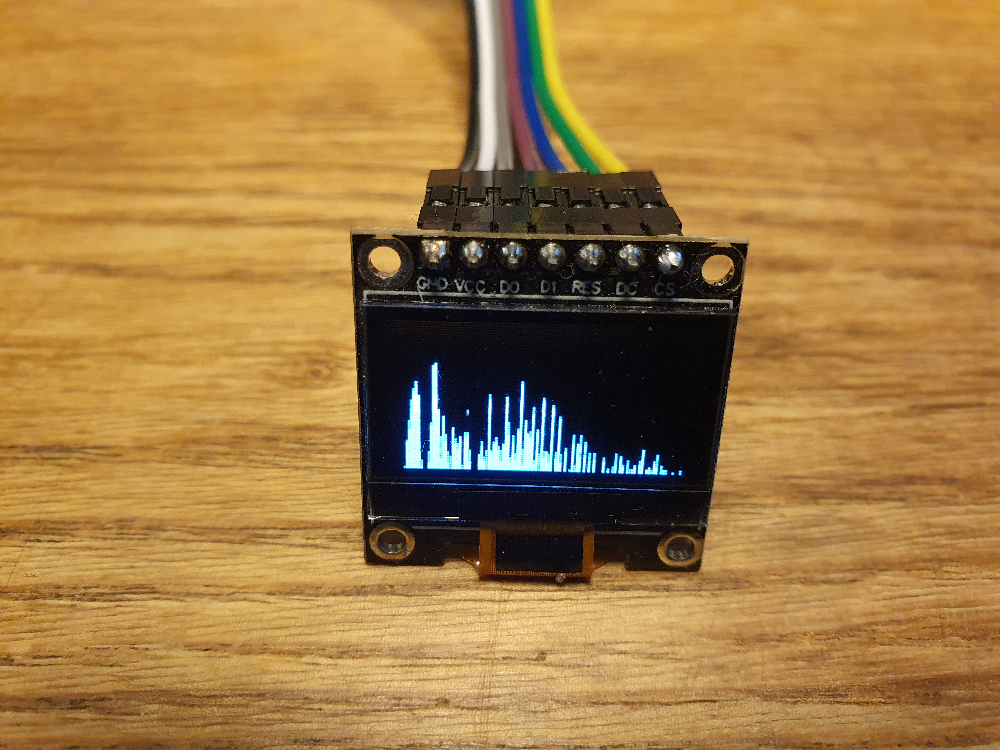
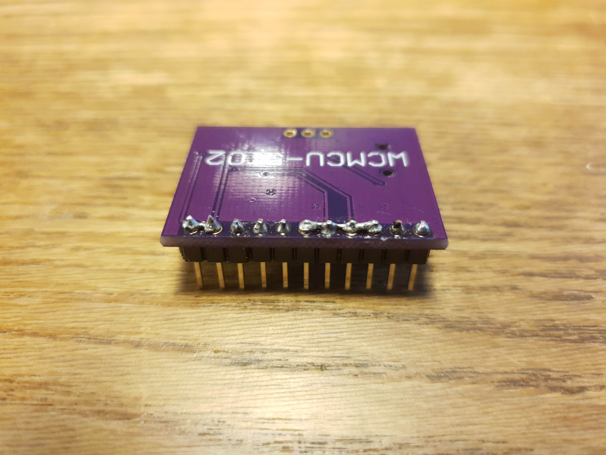
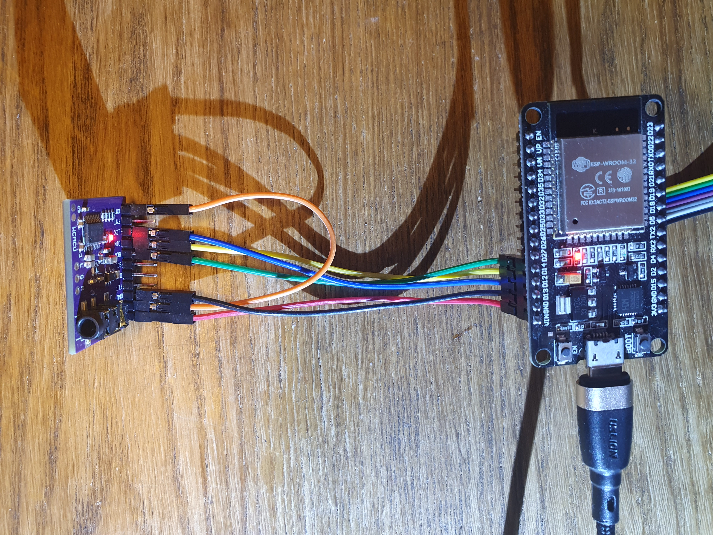

# Acid Analyzer OLED


Idle logo | Playing audio
:-: | :-:
 | 


Audio spectrum analyzer for the esp32 using Bluetooth and SSD1306
This is the 0.96" SSD1306 OLED screen version of my 50 times bigger LED screen version
https://github.com/yliniemi/bluetooth-spectrum-analyzer

I use PCM5102A DAC for audio output. It's a great cheap DAC with 112 dB signal to noise ratio. It supports 16, 24 and 32 bit stereo audio. This is great because I can do the audio math and output at 32 bits and gain the ability to control volume without losing any audio quality. I can actually lower the output volume by 18 dB and still get the full 96 dB that the 16 bit signal offers before hitting the noise floor at -112 dB.

I get around 132 frames per second. This is more than SSD1306 107 Hz refresh rate. I'd like to have vertical synchronization. The SSD1306 supports that but the vsync pin isn't connected to the flat cable. I could connect a wire straight to the controller but I'd need to break the glass cover and do microscopic soldering. It's not worth it.

Here are some videos of this product in action [Strange Stuff - Matt Harris](https://www.youtube.com/watch?v=4EGAA55oB28), [Mysterious Strange Things - Yung Logos](https://www.youtube.com/watch?v=7RTh4Is6EKA)


## Wiring

I used an esp32 dev board. It's the cheapest. I connected PCM5102A to the left side because it has the 5 volt pin. The three I2S pins are next to the power. The order is the same on the DAC side if you get [this PCM5102A PCB from Aliexpress](https://www.aliexpress.com/item/1005002898278583.html). I on the other had have a different PCB so the pin order is different. I'll update these pictures as soon as the new small PCBs arrive in the mail.


#### PCM5102A

On the back side of the wide PCM5102A solder GND, FLT, DMP and SCL pins together. Also solder FMT and XMT pins together and connect them to the 3.3 volt pin with a jumper cable in the PCM5102A. These pins choose the settings of the DAC.

ESP32 | PCM5102A
:-: | :-:
5 V | VCC
GND | GND
pin 13 | LCK
pin 12 | DIN
pin 14 | BCK
not connected | 3.3V, FTM & XMT

Soldering | Wiring
:-: | :-:
 | 


#### SSD1306

Connecting the OLED is super easy. Barely an inconvenience. The pins are all in order on both the ESP32 and the SSD1306 with the exeption of the power pins. Those are twisted. I skipped the first two gpio pins because pin 2 controls the built in led and I wanted the pins to be consecutive and in the same order as on the SSD1306.

ESP32 | SSD1306
:-: | :-:
3.3 V | VCC
GND | GND
pin 4 | D0
pin 16 | D1
pin 17 | RES
pin 5 | DC
pin 18 | CS


## Installation

```console
git clone https://github.com/yliniemi/AcidAnalyzerOLED
cd AcidAnalyzerOLED
esptool.py write_flash 0x1000 binaries/32MHz_SPI/bootloader.bin 0x8000 binaries/32MHz_SPI/partition-table.bin 0x10000 binaries/32MHz_SPI/ssd1306_spectrum.bin
```


## Compilation

```console
You can compile the source code after I add it to the repository. Currently it's not here. I have some lisencing conflicts with the libraries I'm using.
esp-idf 5.1.1 had some issues. The program didn't compile if I told the compiler to optimise for speed. Compiling with debug works. This is a known bug and is fixed on the esp-idf current but not in any of the actual numbered releases. I will update this line when they get it fixed in a release.

git clone https://github.com/yliniemi/AcidAnalyzerOLED
cd AcidAnalyzerOLED
idf.py menuconfig
idf.py build
idf.py flash
```


## Known bugs

I used a novel way to control the volume. I don't lose any detail when lowering the volume. The downside is that some phones lower the volume with software before sending it. The phones that don't support setting the absolute volume at the receiving Bluetooth device don't advertise this fact. Or at least I don't know how to find it out. If the phone controls the volume with software before sending it, I should set the volume to the maximum on the receiving device. This is problematic because if the phone does support setting the absolute at the receiving device, the default volume after turning on my device would be very high. This is why I set the default volume at -18 dB. It's high enough that you will hear something but low enough so you don't blow your eardrums when you restart this device.
